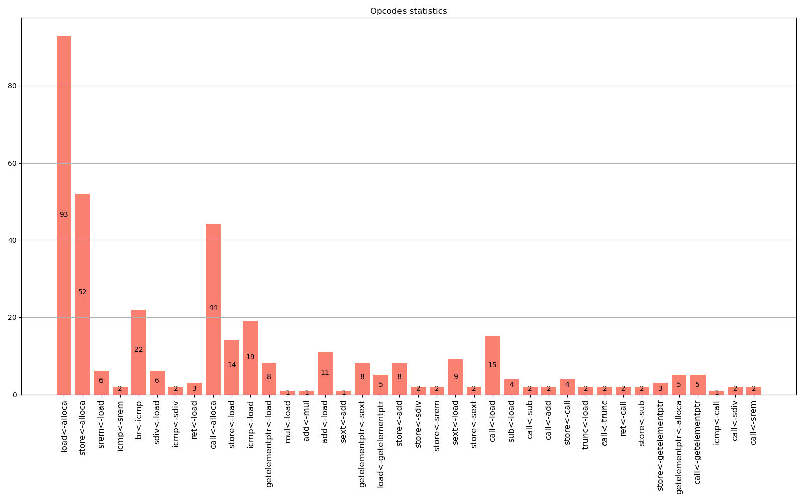
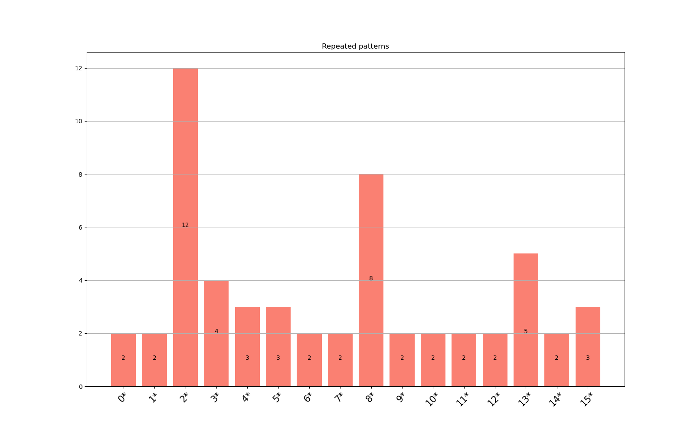

Here is the task2 for the course on LLVM :\
\
Use the LLVM Pass to collect a trace of the instructions utilized by a graphical application at the optimization level -O2

Build:
```shell
cd *path/to/repo/trace*
mkdir build
cd build
cmake -GNinja .. -DAPP_SRC_DIR=*path/to/graphical/app*
ninja run_llvm_pass
```

The instruction trace will be recorded in  statistics/pass_log.txt

A route of instructions collected during the execution of the graphic application stored in **statistics/pass_log.txt**


### Instruction call frequency statistics
Showed in *statistics/opcodes_statistics.png*:



### Frequency of calls for instruction combinations of length 5 and less
(Entries with "load", "call", and "store" are excluded):


[see legend here](/guides/content/editing-an-existing-page#modifying-front-matter)
