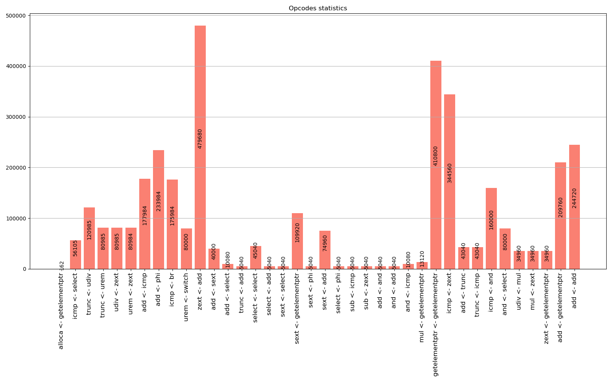

Here is the task2 for the course on LLVM :\
\
Use the LLVM Pass to collect a trace of the instructions utilized by a graphical application at the optimization level -O2

Build:
```shell
cd *path/to/repo*
repo=$(realpath)
cd trace
mkdir build
cd build
clang++ ../inst_collector.cpp -undefined dynamic_lookup -fPIC -shared -I$(llvm-config --includedir) -o libPass.so
clang -fpass-plugin=./libPass.so $repo/sdl/app.c -O2 -c
clang $repo/sdl/main.c $repo/sdl/sim.c ../logger.c app.o -lSDL2
./a.out > statistics/pass_log.txt
```

The instruction trace will be recorded in  statistics/pass_log.txt

A route of instructions collected during the execution of the graphic application stored in **statistics/pass_log.txt**


### Instruction call frequency statistics

```shell
cd *path/to/repo/trace/statistics*
python3 stat.py
```
Showed in *statistics/opcodes_statistics.png*:

